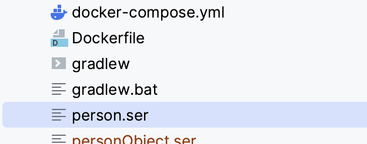
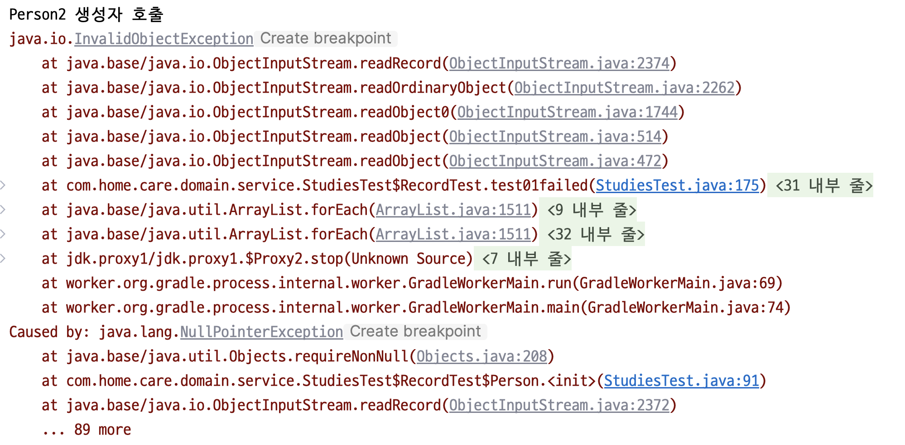
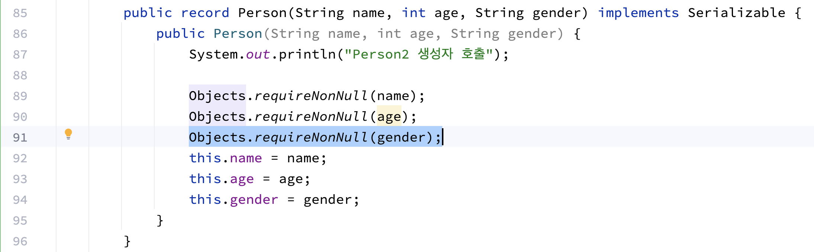
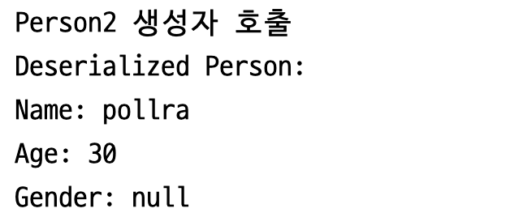

# 05.레코드

> 책 에서는 레코드의 사용 방법을 설명 하고, 누락된 기능 을 설명 한다.
> 물론 표면적인 지식 (누락된 기능은 무엇이 있으며, 이것은 어떤 것을 말한다. 이것은 어떻게 우회 할 수 있다.) 도 중요 하다.
> 하지만 우리는 이미 코드적으로 `레코드` 를 어떻게 사용하는지 알고 있다. 
> 누락된 상황은 겉 표면의 지식이며 이것은 근본적인 지식이 아니다. 
> 겉 표면의 지식은 근본 지식의 뿌리를 두고 변경된다.
> 레코드가 왜 만들어졌는지, 레코드가 어떤 의미를 담고 있는지를 알아야 한다.
> 
> 이 문서 에서는 책에서 표현하는 겉 정보를 담고 있지 않다.
> 이미 IDEA 에서 지원하는 많은 기능들은 그것을 보다 간편히 설명 해 주기 때문에 따로 서술 할 필요를 느끼지 못했다.

## 레코드를 만든 목표와 비목표

자바의 클래스 문법은 '저는 데이터 캐리어 입니다' 라는 것을 표현 하기에는 적절하지 못함
레코드는 자바에서 '데이터를 데이터로 모델링 하는 것' 을 지원하기 위한 방법으로 삼음.

### 목표

* Java 14 에서 미리보기 기능으로 제공 됨
* 값의 간단한 집계를 표현하는 객체 지향적 구조를 제공하기 위해 만들어짐
* 개발자가 확장 가능한 동작 보다는 변경 불가능한 데이터 모델링에 집중하도록 도와줌
* 접근자, 생성자, Equals, ToString 등의 메서드를 자동으로 만들어줌

### 비목표

* 보일러 플레이트와의 전쟁을 선언하는 것은 아님.
* JavaBeans 명명 규칙을 사용하는 가변 클래스의 문제 해결이 목표가 아님
* 일반적인 자바 클래스 생성 시의 애노테이션 기반 코드 생성과 같은 기능을 추가하는 것이 목표가 아님.

## 레코드의 구문

> 레코드는 클래스의 한 종류 이다.

```Java
record Point(int x, int y) { }
```

* 레코드의 선언은 주로 '상태' 의 선언으로 구성 된다
* 헤더에 작성 된 멤버(`int x, int y`)는 `private final` 과 같은 유형을 갖게 된다.
* 레코드 클래스의 생성자는 자동으로 만들어지며 개발자가 헤더에 지정 한 값을 기준으로 만들어진다.
* Object.class 의 equals, hashCode 가 자동으로 오버라이딩 된다.
* toString 메서드가 자동으로 오버라이딩 된다.

## 상태

> 여러분이 생각하는 `상태` 는 무엇인가?

상태는 객체 지향에서 표현하는 `상태` 의 의미와 같다

객체지향 에서는 각자 표현하는 방식은 다르지만, 객체를 정의하는 기준은 비슷하다.

> 객체는 상태와 행동을 갖는 대상이다.

행동은 function 이자 action 이며, 객체가 '가져야 할' 기능적 측면을 말한다.
그렇다면 상태는 무엇인가?


상태는 객체가 가져야 할 데이터를 의미 한다.


```Java
class Book {
    private Long id;
    private String name;
    private Integer pageCount;
    private BookType type;
    private RentalState rentalState;
    private final Date createdDate; // 책의 출시 년도
    private Area area;
}
```

여기서 name, pageCount, type, rentalState, createdDate, area 는 책이 가지고 있는 6가지 상태 이다

이 상태들은 각 사용 목적에 따라 변경 될 수도 있고, 변경되지 않을 수도 있다.

만일 도서 관리자가 도서관의 구조 변경을 좋아하는 사람이어서, Area 객체를 DB 에 저장한다고 생각 해 보자

그럼 Area 내부의 상태는 변경될 수 있어야 한다.

이것은 상태 중 변경 가능한 Mutable 객체로 취급 된다

그렇다면 Date, BookType, String 등의 객체는 어떤가?

이들은 모두 Immutable 하다.<br/>
각 상태들은 Book 클래스 기준에서의 `변경` 은 가능하지만 각 객체가 자신이 가지는 값의 `변경`은 불가능하다.

이런 형태의 데이터는 `record` 로 관리 될 수 있으며 불변하므로 `불변객체` 에 속하게 된다

자바에서 만든 record 는 이러한 불변함을 지원하기 위해 만들어졌다.

### 변경들의 차이

위에서 말 한 문장을 곱씹어, 천천히 소화 해 보자

> 각 상태들은 Book 클래스 기준에서의 `변경` 은 가능하지만 각 객체가 자신이 가지는 값의 `변경`은 불가능하다.

이 말은 어떤 뜻일까?

여기서 Book 클래스는 DB 로 관리 되는 값이다.<br/>
OOP 에서는 객체 라고 불리며 DDD 에서는 Entity 라고 불린다.<br/>
(이 예시 에서는 OOP 보다는 DDD 가 좀 더 명확하다.)

어떠한 목적으로 책의 이름이 바뀌거나, 수정 될 수 있다는 이야기 이다.

그리고 이 수정은 DB 에서 관리 되며 영속화 된다.

변경 되는 중간 중간의 값들은 모두 history 로서 관리 가능하다

이 특성은 같은 Entity 인 Area 도 갖게 된다. <br/>
이는 도서관의 주인이 리모델링을 좋아하기 때문에 갖게 된 Area 의 특성이다.

반면에 BookType 이라는 상태는, 이러한 특성을 가지지 못한다

`값 객체` 이기 때문이다.

만일 도서관을 가지고 있는 사람이 도서관의 구조 변경을 별로 안좋아해서, 변경을 할 필요가 없다면 어떻게 될까?

이 역시 `값 객체` 가 될 수 있다. <br/>
DB 에 저장 할 필요가 없어지고 변경 된 이력을 관리 할 필요가 없게 되기 때문이다.

> 논리적으로 틀린 부분이 있다면 지적 바람.

## Record 의 상속

우리가 만든 클래스들은 모두 Object 를 상속 한다.

지금 익히고 있는 이 record 역시 Object 를 상속 한다. 하지만 직접적인 상속은 아니다.

Record 클래스가 존재하며 이 클래스를 상속하는 구조로 record 키워드는 동작한다.<br/>
Record 클래스는 java.lang.Record 를 idea 에서 검색 해 보면 찾아 볼 수 있다.

따라서 Record 클래스의 여러 기능들을 갖게 된다

* equals
* hashCode
* toString

위 구현체는 따로 정리하지 않아도 어떤 의미인지 알 수 있을 거라 생각된다

그렇다면 차이가 발생하는 구간을 살펴 보자

## Record 의 직렬화(마샬링)

Serializable 은 직렬화를 지원하는 클래스에 구현 하므로서 idea 및 JVM 에게 해당 객체가 직렬화 가능한 대상임을 나타낸다

우리가 작성 하는 Object 의 Serializable 은 Java 의 Reflection 을 사용하여 직렬화/역직렬화가 이루어 진다.

여기서 두 구현의 차이점이 존재 한다

### Object 의 역직렬화

Object 는 역직렬화 수행 시 위에서 언급 했듯, Java 의 Reflection 을 이용한다.

이 과정을 조금 더 자세히 설명 하면 아래와 같이 이루어 진다

아래는 역직렬화(언마샬링) 과정이다.

1. Java reflection 을 이용하여 NoArgsConstructor 를 호출한다
2. 만들어진 인스턴스에 리플렉션을 이용하여 값을 넣어 준다
3. 객체의 역직렬화가 완료되고 정상적인 인스턴스가 만들어진다.

여기까지 보면 문제가 없어 보일 수 있다

하지만 문제가 발생하는 부분은, 디버깅을 할 때 이다.

Java 의 Reflection 을 사용하고 NoArgsConstructor 를 사용하기 때문에 어떤 부분에서 오류가 발생 했는지 알기 어렵다

아래는 간단한 테스트 코드 이다.

```Java
static class PersonObject implements Serializable {
    private String name;
    private int age;

    public PersonObject(String name, int age) {
        System.out.println("PersonObject 생성자 호출");
        this.name = name;
        this.age = age;
    }

    public String getName() {
        return name;
    }

    public int getAge() {
        return age;
    }
}

@Test
@DisplayName("Object serialization test")
public void objectSerializationTest() {
    var person = new PersonObject("pollra", 30);

    System.out.println(person);

    try (FileOutputStream fileOut = new FileOutputStream("personObject.ser");
         ObjectOutputStream out = new ObjectOutputStream(fileOut)) {
        out.writeObject(person);
        System.out.println("Serialized data is saved in personObject.ser");
    } catch (Exception e) {
        e.printStackTrace();
    }

    try (FileInputStream fileIn = new FileInputStream("personObject.ser");
         ObjectInputStream in = new ObjectInputStream(fileIn)) {
        PersonObject person2 = (PersonObject) in.readObject();
        System.out.println("Deserialized Person:");
        System.out.println("Name: " + person2.getName());
        System.out.println("Age: " + person2.getAge());
    } catch (Exception e) {
        e.printStackTrace();
    }
}
```

위 코드는 객체를 직렬화 하여 파일로 저장하고, 저장 된 파일을 다시 불러와서 역직렬화 하는 코드 이다.

위 코드의 동작 결과는 아래와 같다.


이 코드의 결과물로 프로젝트의 루트 경로에 personObject.ser 파일이 생기는데 우리는 이 파일을 활용하여 일부러 문제를 발생 시킬 것이다

위 코드는 놔두고, 새로 PersonObject 를 작성한다. 이 새로운 객체는 기존의 PersonObject 의 위치와 같아야 한다.

```Java
static class PersonObject implements Serializable {
    private String name;
    private int age;
    private String gender;

    public PersonObject(String name, int age, String gender) {
        System.out.println("PersonObject 생성자 호출");
        this.name = name;
        this.age = age;
        this.gender = gender;
    }

    public String getName() {
        return name;
    }

    public int getAge() {
        return age;
    }
    
    public String gender() {
        return gender;
    }
}

@Test
@DisplayName("Object serialization test")
public void test02() {
    // 이미 personObject.ser 파일이 생성되어 있다
    // 따라서 해당 직렬화 파일을 읽어와서 역직렬화를 시도 한다.
    try (FileInputStream fileIn = new FileInputStream("personObject.ser");
         ObjectInputStream in = new ObjectInputStream(fileIn)) {
        PersonObject person2 = (PersonObject) in.readObject();
        System.out.println("Deserialized Person:");
        System.out.println("Name: " + person2.getName());
        System.out.println("Age: " + person2.getAge());
    } catch (Exception e) {
        e.printStackTrace();
    }
}
```

여기서 발생하는 에러 코드를 확인 해 보자


어떠한 오류가 발생 했는지 알 수 없다.

오류 라인을 보여주는 부분이 있는데, 이를 따라가 보면 아래의 코드에서 오류가 발생 했다고 알림을 주고 있다

```Java
PersonObject person2 = (PersonObject) in.readObject();
```

지금 껏 설명을 집중한 개발자는 '이건 당연히 gender 가 추가 되었기 때문에 serialVersion 이 맞지 않아 생기는 문제잖아?' 라고 생각 할 수 있다

디버깅 시 제공되는 에러는 개발자의 많은 시간을 단축 시켜준다. <br/>
하지만 위의 오류는 정확한 원인을 보여줄 수 없다.

그렇다면 Record 의 역직렬화 과정은 어떨까?

### Record 의 역직렬화

record 역시 Reflection 을 이용한다. record 의 역직렬화 과정은 아래와 같다

1. Java 의 reflection 을 이용하여 record 의 AllArgsConstructor 를 호출한다
2. 역직렬화 대상의 데이터를 생성자에 넣고 새로운 record 객체를 생성한다
3. 객체의 역직렬화가 완료되고 정상적인 인스턴스가 만들어진다.

이를 테스트 하는 코드는 다음과 같다.

```Java
public record Person(String name, int age) implements Serializable {
    public Person(String name, int age) {

        System.out.println("Person 생성자 호출");
        this.name = name;
        this.age = age;
    }
}

@Test
@DisplayName("Record serialization test")
public void recordSerializationTest() {
    var person = new Person("pollra", 30);
    
    System.out.println(person);

    try (FileOutputStream fileOut = new FileOutputStream("person.ser");
         ObjectOutputStream out = new ObjectOutputStream(fileOut)) {
        out.writeObject(person);
        System.out.println("Serialized data is saved in person.ser");
    } catch (Exception e) {
        e.printStackTrace();
    }

    try (FileInputStream fileIn = new FileInputStream("person.ser");
         ObjectInputStream in = new ObjectInputStream(fileIn)) {
        Person person2 = (Person) in.readObject();
        System.out.println("Deserialized Person:");
        System.out.println("Name: " + person2.name());
        System.out.println("Age: " + person2.age());
    } catch (Exception e) {
        e.printStackTrace();
    }
}
```

위 테스트를 통해 record 의 직렬화 파일을 만들어 보자


Person 의 생성자가 두 번 호출되는 모습을 확인 할 수 있다.

이를 통해 우리는 한가지를 예측 해 볼 수 있다.

> 만일, 생성자에 값의 null check 로직을 넣는다면? <br/> 
> 디버깅 시 정확한 오류를 내뱉을 수 있겠구나!



직렬화 된 파일은 정상적으로 생성 된 모습을 확인 할 수 있다.

그럼 이제 위의 PersonObject 와 마찬가지로 Person 에 상태를 추가하여 고의적으로 오류를 발생 시켜 보자

```Java
public record Person(String name, int age, String gender) implements Serializable {
    public Person(String name, int age, String gender) {
        System.out.println("Person2 생성자 호출");

        Objects.requireNonNull(name);
        Objects.requireNonNull(age);
        Objects.requireNonNull(gender);
        this.name = name;
        this.age = age;
        this.gender = gender;
    }
}
@Test
@DisplayName("Record serialization test")
public void recordSerializationFailedTest() {
    try (FileInputStream fileIn = new FileInputStream("person.ser");
         ObjectInputStream in = new ObjectInputStream(fileIn)) {
        Person person2 = (Person) in.readObject();
        System.out.println("Deserialized Person:");
        System.out.println("Name: " + person2.name());
        System.out.println("Age: " + person2.age());
    } catch (Exception e) {
        e.printStackTrace();
    }
}
```

실행 결과는 어떨까?



자칫 보면 Object 의 결과와 같아 보일 수 있다.

하지만 오류 문구를 확인 해 보면 아래와 같은 문구를 확인 할 수 있다

```Java
Caused by: java.lang.NullPointerException
	at java.base/java.util.Objects.requireNonNull(Objects.java:208)
	at com.home.care.domain.service.StudiesTest$RecordTest$Person.<init>(StudiesTest.java:91)
```

생성자가 호출 되었으며, StudiesTest.java:91 라인 에서 오류가 발생한다는 것을 알 수 있다



그렇다면 만일 객체변경 후 `Objects.requireNonNull` 을 추가하지 않는다면 어떻게 될까?



Object 의 구현과 달리 정상적으로 생성 되는 모습을 볼 수 있다

gender 에서는 우리가 예상 할 수 있는, null 이 들어갔다

여기서 당연히 성능적 이점도 가져올 수 있다

## 마무리

이처럼 우리가 사용하는 record 는 한가지 상태를 저장하기 위한 ValueObject 로서의 기능을 수행 한다

상태 라는 개념은 우리가 객체를 설계 할 때 관리객체와 비관리 객체에 대한 새로운 대안을 제시할 수 있다<br/>
(엔티티는 왜 엔티티여야 하는가? ValueObject 로 작성되어도 될텐데? 라는 시야)

`값은 변경 되는게 아니라 대입 되는 것이다` 라는 문구는, 새로운 시야를 가져다 줄 것이다

추가로 `타입` 에 대해서도 한 번 생각 해 보는게 좋은데, 이건 각자 공부 해 보는걸로 하자


## 참고

* [JEP-395](https://openjdk.org/jeps/395)
* Java 의 코드: java.lang.Record
* [더 나은 직렬화를 향하여-Brian Goetz](https://openjdk.org/projects/amber/design-notes/towards-better-serialization)
* [Serialized of record](https://blogs.oracle.com/javamagazine/post/simpler-object-and-data-serialization-using-java-records)
* [Record Serialization](https://inside.java/2020/07/20/record-serialization/)
