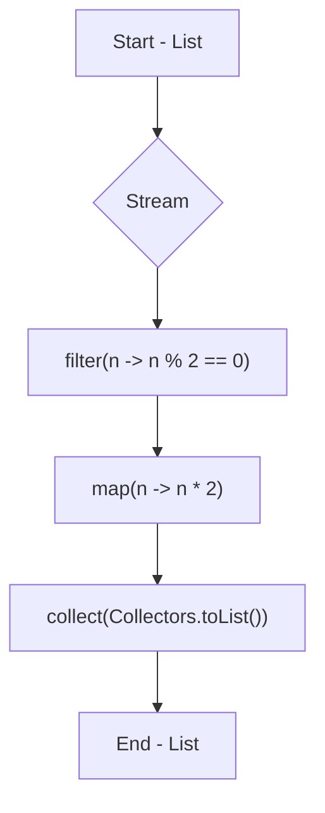
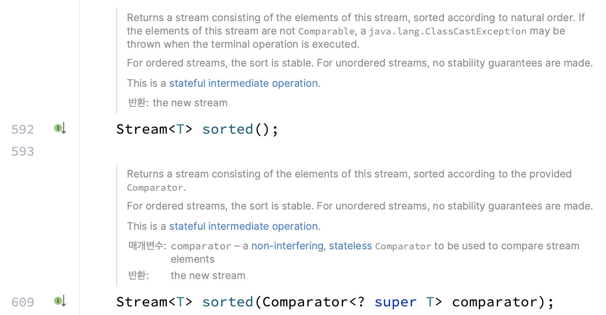

# 06.스트림

## 06.01 문법

```Java
import java.util.Arrays;
import java.util.List;
import java.util.stream.Collectors;

public class StreamExample {
    public static void main(String[] args) {
        List<Integer> numbers = Arrays.asList(1, 2, 3, 4, 5, 6, 7, 8, 9, 10);

        // Stream 생성
        List<Integer> evenNumbers = numbers.stream()
            .filter(n -> n % 2 == 0)  // 무상태 연산: 짝수 필터링
            .map(n -> n * 2)          // 무상태 연산: 두 배로 변환
            .collect(Collectors.toList()); // 최종 연산: 리스트로 수집

        System.out.println(evenNumbers); // 출력: [4, 8, 12, 16, 20]
    }
}
```

위 코드의 처리 과정은 아래와 같다



1.	Start - List: 초기 리스트가 주어짐.
2.	Stream: 스트림이 생성됨.
3.	filter(n -> n % 2 == 0): 무상태 연산을 통해 짝수만 필터링함.
4.	map(n -> n * 2): 각 요소를 두 배로 변환함.
5.	collect(Collectors.toList()): 최종 연산으로 리스트로 수집함.
6.	End - List: 최종 결과 리스트가 생성됨.

## 06.02 연산 체계

위에서 볼 수 있듯, 스트림은 여러 연산 기법을 제공하며 연산 기법은 총 두가지로 나눌 수 있다

### 06.02.01 상태 유지 연산 (Stateful Operations)

상태 유지 연산은, 이전 요소나 다른 상태를 유지하고 그것에 의존하여 결과를 생성하는 연산이다
이러한 연산은 전체 스트림 요소를 필요로 하거나 요소의 순서에 의존 하므로 병렬 처리에서 제한이 있을 수 있다

대표적인 상태 유지 연산은 아래와 같다

* `sorted(Comparator<? super T> comparator)` : 스트림의 요소 정렬
  > 전체 스트림 요소를 탐색 하여 정렬을 수행해야 하므로 상태를 유지해야 함
  
* `distinct()` : 중복된 요소를 제거
  > 중복 여부 판단을 하려면 이전에 처리한 요소들을 기억해야 함
   

### 06.02.02 무상태 연산 (Stateless Operations)

무상태 연산이란 스트림의 각 요소를 독립적으로 처리 하는 연산을 말한다
이는 특정 요소를 처리 할 때, 다른 요소의 상태에 의존하지 않음을 의미 한다

* `filter(Predicate<? super T> predicate)`
  > 주어진 조건(predicate)을 만족하는 요소만을 필터링
  
* `map(Function<? super T, ? extends R> mapper)`
  > 각 요소를 다른 객체로 매핑
  
* `flatMap(Function<? super T, ? extends Stream<? extends R>> mapper)`
  > 각 요소를 여러 요소로 확장하고, 이를 하나의 스트림으로 평탄화함.
  
* `peek(Consumer<? super T> action)`
  > 스트림의 각 요소를 소비하지 않고 중간에서 볼 수 있게 한다.
  

## 06.03 Fork / Join 프레임워크

스트림은 병렬 실행을 효율적으로 지원하도록 설계 되었다.

> 단, 항상 모든 경우에 Fork/Join 프레임워크를 사용하는 것은 아니다
> 일반적으로 아래와 같은 코드는 시퀀셜 스트림이라고 하여 순차 처리를 진행 하며
> 
> ```Java
> List.of(1, 2, 3, 4, 5).stream()
> ```
> 
> 아래 처럼 병렬 스트림으로 처리 해야 Fork/Join 프레임워크를 사용한 동작을 수행한다
>
> ```Java
> List.of(1, 2, 3, 4, 5).parallelStream()
> ```

내부적으로는 Fork / Join 프레임워크를 사용하여 이러한 병렬 처리를 구현 했는데, 이는 Java 7 에서 추가 되었다

### 06.03.01 Fork/Join Framework 란?

병렬화 할 수 있는 작업을 재귀적으로 작은 작업으로 분할한 다음 서브태스크 각각의 결과를 합쳐서 전체 결과를 만들도록 설계 되었다

하나의 작업을 작은 단위로 나눠서 여러 쓰레드가 동시에 처리 하는 것을 쉽게 만들어 준다

이 알고리즘은 분할 후 정복 알고리즘의 병렬화 버전 이다

Fork/Join 의 과정을 그림으로 보면 아래와 같다


Stream 의 내부 동작을 이해 하면 비즈니스 구현 시 효율적인 기술 선택에 도움이 될 것이다

아래의 구현을 통해 Fork/Join 의 이해를 높여보자

```Java
public class FibonacciTask extends RecursiveTask<Integer> {
	private final int n;

	public FibonacciTask(int n) {
		this.n = n;
	}

	@Override
	protected Integer compute() {
		System.out.println("Thread: " + Thread.currentThread().getName() + " n: " + n);
		if (n <= 1) {
			return n;
		}
		FibonacciTask f1 = new FibonacciTask(n - 1);
		f1.fork(); // 비동기적으로 실행
		FibonacciTask f2 = new FibonacciTask(n - 2);
		return f2.compute() + f1.join(); // 결과 합치기
	}

	public static void main(String[] args) {
		ForkJoinPool pool = new ForkJoinPool();
		FibonacciTask task = new FibonacciTask(10);
		int result = pool.invoke(task);
		System.out.println("Fibonacci number: " + result);
	}
}
```

아래는 결과 이미지 이다


## 06.04 Stream 연산 비용

Stream 은 쇼트 서킷의 특성을 지니고 있다

따라서 이를 이해 하면 스트림을 보다 더 효율적으로 사용 할 수 있다

### 06.04.01 쇼트 서킷(Short circuit)이란?

쇼트 서킷은 논리 연산 평가를 최적화 하는 기법을 말한다

우리가 자주 사용하는 && 연산자나 || 연산자도 소트 서킷을 기반하고 있다

### 06.04.02 Stream 에서의 쇼트 서킷

Stream 에서도 비슷한 형태의 쇼트 서킷을 지원 하는데, 아래의 예시를 확인 해 보자

```Java
Stream<String> stream = Stream
    .of("ananas", "banana", "apple", "orange", "grapes");

stream
    .map(s -> {
        System.out.println("Mapping: " + s);
        return s.toUpperCase();
    })
    .sorted((o1, o2) -> {
        System.out.println("Sorting: " + o1 + " " + o2);
        return o1.compareTo(o2);
    })
    .filter(s -> {
        System.out.println("Filtering: " + s);
        return s.startsWith("a");
    })
    .forEach(System.out::println);
```

위 코드의 결과를 확인 해 보면 각 stream 함수의 실행 횟수는 아래와 같다

* map: 5
* sorted: 8
* filter: 5

그런데 사실 filter 된 결과를 최종적으로 출력하고 있기 때문에 그 외의 요소는 연산을 수행 할 필요가 없다

최적화를 위해 filter 를 맨 위로 위치 시키면 실행의 횟수가 달라지게 된다.

```Plain Text
Filtering: ananas
Mapping: ananas
Filtering: banana
Filtering: apple
Mapping: apple
Filtering: orange
Filtering: grapes
Sorting: APPLE ANANAS
```

(위 결과를 보면 순서가 이상하다는 것을 느낄 수 있다. <br/>그건 #왜 순서대로 실행되지 않을까? 에서 확인 하도록 하고 일단 넘어가자)

* filter: 5
* map: 2
* sorted: 1

단순히 실행의 흐름만 바꿨을 뿐인데 실행 횟수가 18 -> 8 로 변경되는 모습을 확인 할 수 있다.

> 왜 순서대로 실행되지 않을까?
> 
> 기본적으로 시퀀셜 스트림을 사용하는 단일 스레드의 실행 에서는 병렬 연산이 수행되지 않는다
> 
> 위의 코드도 마찬가지 이다. 하지만 실행 결과를 보면 우리의 눈을 의심하게 만든다.
> 
> 위의 실행 결과는 병렬로 실행 된 것일까?
> 
> 해당 실행에 대한 좀 더 자세한 사항은 Java Stream 의 filter 구현체를 보면 이해가 쉽다
> 
> ```Java
> @Override
>   public final Stream<P_OUT> filter(Predicate<? super P_OUT> predicate) {
>       Objects.requireNonNull(predicate);
>       return new StatelessOp<P_OUT, P_OUT>(this, StreamShape.REFERENCE,
>                                    StreamOpFlag.NOT_SIZED) {
>           @Override
>           Sink<P_OUT> opWrapSink(int flags, Sink<P_OUT> sink) {
>               return new Sink.ChainedReference<P_OUT, P_OUT>(sink) {
>                   @Override
>                   public void begin(long size) {
>                       downstream.begin(-1);
>                   }
>                   @Override
>                   public void accept(P_OUT u) {
>                       if (predicate.test(u))
>                           downstream.accept(u);
>                   }
>               };
>           }
>       };
>   }
> ```
> 
> 해당 구현체를 보면 StatelessOp 이라는 것을 리턴하는 모습을 볼 수 있다
> 
> 이는 Map 도 마찬가지 이다
> 
> 하지만 sort 는 위의 구현과 다르게 Stateful 구현체 이다
> 
> 따라서 기존의 연산들이 모두 완료 된 후의 결과를 가지고 연산을 한다는 의미 이다
> 
> 그렇기 때문에 Stateless -> Stateless 로의 스트림 파이프라인 구성은, UpStream 의 실행이 완료 되면 바로 DownStream 의 동작을 연계 한다
> 
> Stateless -> Stateful 의 스트림 파이프라인은 UpStream 의 모든 동작이 완료 된 후 DownStream 의 동작이 적용 된다
> 
> 따라서 위의 로그 결과가 나오게 되는 것이다

## 참고 링크

* https://devbksheen.tistory.com/entry/%EB%AA%A8%EB%8D%98-%EC%9E%90%EB%B0%94-%ED%8F%AC%ED%81%AC%EC%A1%B0%EC%9D%B8-%ED%94%84%EB%A0%88%EC%9E%84%EC%9B%8C%ED%81%AC%EB%9E%80-%EB%AC%B4%EC%97%87%EC%9D%B8%EA%B0%80
* https://www.geeksforgeeks.org/difference-between-fork-join-framework-and-executorservice-in-java/
* https://docs.oracle.com/javase/tutorial/essential/concurrency/forkjoin.html
* Class : java.util.stream.ReferencePipeline
